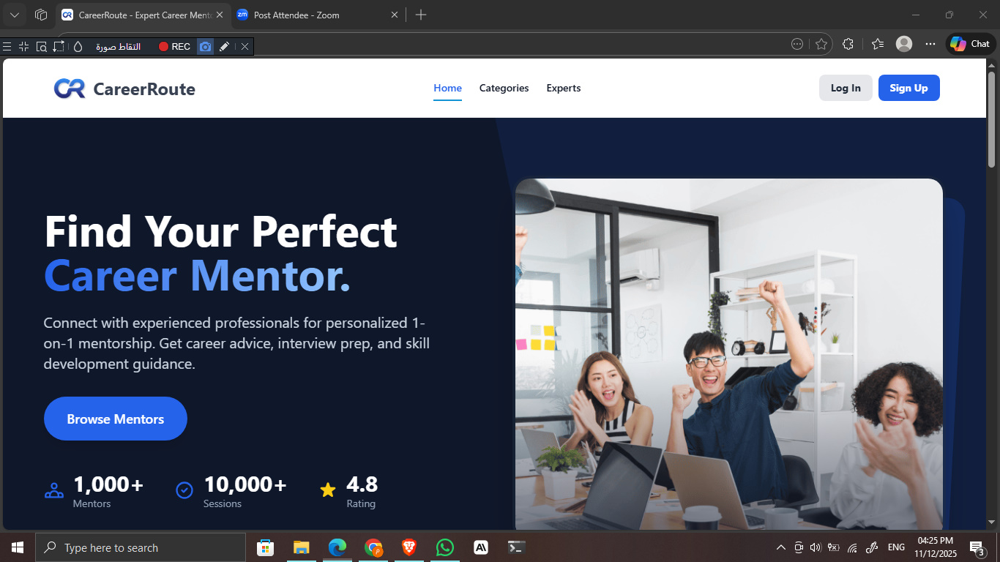
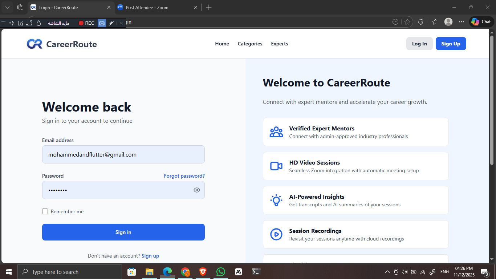
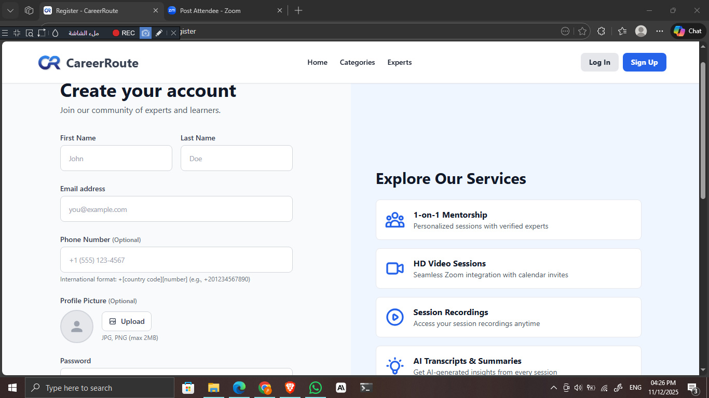
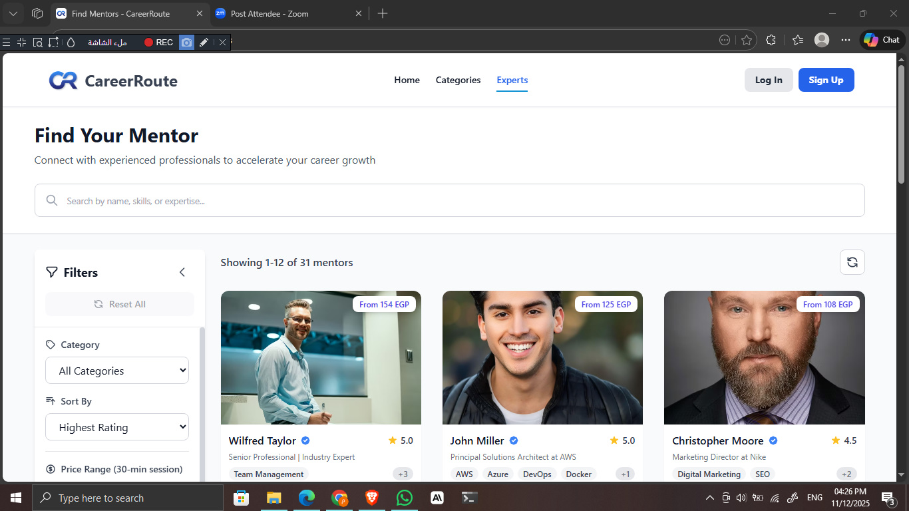
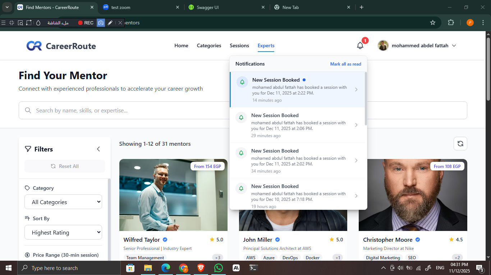

<div align="center">

# 🚀 CareerRoute

### AI-Powered Mentorship Platform

*Connecting students, graduates, and early professionals with experienced mentors for personalized career guidance*

[](https://careerroute.netlify.app)
[](https://angular.io/)
[](https://dotnet.microsoft.com/)
[](https://www.microsoft.com/sql-server)

[Live Demo](https://careerroute.netlify.app) • [Features](#-features) • [Tech Stack](#-tech-stack) • [Getting Started](#-getting-started)

</div>

---

## 📖 Overview

CareerRoute is a full-stack mentorship platform designed for the MENA/Egypt market. It provides an end-to-end solution for mentor discovery, session booking, payments, video conferencing, and AI-powered session intelligence.

**Key Highlights:**
- 🎯 Localized for Arabic-speaking markets with local payment methods
- 🤖 AI-powered session transcription and summarization
- 💳 Dual payment gateway (Stripe + Paymob)
- 📹 Automated Zoom integration
- ⚡ Real-time notifications

---

## ✨ Features

### Core Features
- **Authentication** - JWT-based auth with email verification & password reset
- **Mentor Discovery** - Search, filter by category/price/rating, and sort mentors
- **Session Booking** - Time slot management with conflict prevention
- **Dual Payments** - Stripe (USD) + Paymob (EGP, Vodafone Cash, Orange Cash)
- **Video Conferencing** - Auto Zoom meeting creation and termination
- **AI Intelligence** - Session transcription (Deepgram) + summarization (OpenAI)
- **Real-time Updates** - SignalR for instant notifications

### New Features 🆕
- **Review System** - Post-session ratings and reviews
- **Dispute Resolution** - 72-hour dispute window with admin resolution
- **Payout System** - Mentor earnings dashboard with payout requests
- **AI Session Prep** - AI-generated preparation guides for mentors
- **Enhanced Onboarding** - Resume & LinkedIn required for mentor applications
- **Admin Dashboard** - Comprehensive platform management

---

## 🛠️ Tech Stack

### Frontend
| Technology | Purpose |
|------------|---------|
| Angular 20 | SPA Framework |
| TypeScript | Language |
| Tailwind CSS | Styling |
| RxJS | Reactive State |
| Netlify | Deployment |

### Backend
| Technology | Purpose |
|------------|---------|
| ASP.NET Core 8 | Web API |
| C# 12 | Language |
| Entity Framework Core | ORM |
| SQL Server | Database |
| Hangfire | Background Jobs |
| SignalR | Real-time |

### External Integrations
| Service | Purpose |
|---------|---------|
| Stripe | International payments (USD) |
| Paymob | Local payments (EGP) - Cards & Wallets |
| Zoom | Video conferencing automation |
| Deepgram | AI transcription |
| OpenAI | Session summarization |
| Cloudflare R2 | Recording storage |
| SendGrid | Transactional emails |

---

## 🏗️ Architecture

### Backend - Clean Architecture (3-Layer)
```
CareerRoute.API          → Controllers, Middleware
CareerRoute.Core         → Services, Entities, DTOs, Validators
CareerRoute.Infrastructure → Data Access, External Services
```

### Frontend - Feature-Based
```
src/app/
├── core/       → Guards, Interceptors, Global Services
├── shared/     → Reusable Components, Models
└── features/   → Lazy-loaded Feature Modules
```

---

## 🚀 Getting Started

### Prerequisites
- [.NET 8 SDK](https://dotnet.microsoft.com/download)
- [Node.js 18+](https://nodejs.org/)
- [SQL Server](https://www.microsoft.com/sql-server)

### Backend Setup
```bash
cd Backend

# Restore packages
dotnet restore

# Update database
dotnet ef database update --project CareerRoute.Infrastructure --startup-project CareerRoute.API

# Run API
dotnet run --project CareerRoute.API
```

### Frontend Setup
```bash
cd Frontend

# Install dependencies
npm install

# Start development server
npm start
```

---

## 📸 Screenshots

<details open>
<summary><b>🏠 Landing & Authentication</b></summary>

| Home | Login | Register |
|:---:|:---:|:---:|
|  |  |  |

| Email Verification | Email Verified |
|:---:|:---:|
|  |  |

</details>

<details>
<summary><b>🔍 Mentor Discovery</b></summary>

| Categories | Search Results |
|:---:|:---:|
|  |  |

| Mentor Profile | Mentor Reviews |
|:---:|:---:|
|  |  |

</details>

<details>
<summary><b>📅 Sessions & Scheduling</b></summary>

| Manage Slots | Add Slot |
|:---:|:---:|
|  |  |

| Upcoming Sessions | Session Details |
|:---:|:---:|
|  |  |

| Session AI Summary | Notifications |
|:---:|:---:|
|  |  |

</details>

<details>
<summary><b>⚙️ Admin Dashboard</b></summary>

| Dashboard | Users Management |
|:---:|:---:|
|  |  |

| Mentor Approvals | Categories |
|:---:|:---:|
|  |  |

| Skills | Disputes |
|:---:|:---:|
|  |  |

| Payouts |
|:---:|
|  |

</details>

---

## 📁 Project Structure

```
├── Backend/
│   ├── CareerRoute.API/            # Web API layer
│   ├── CareerRoute.Core/           # Business logic & domain
│   ├── CareerRoute.Infrastructure/ # Data access & external services
│   └── Tests/                      # Postman collections
├── Frontend/
│   └── src/app/
│       ├── core/                   # Guards, interceptors, services
│       ├── shared/                 # Reusable components
│       └── features/               # Feature modules
└── Documents/                      # API contracts & documentation
```

---

## 👥 Team

<div align="center">

| Name | Role |
|------|------|
| **Mohamed Adel** (Team Leader) | Full Stack Developer |
| **Mohamed Shehata** | Full Stack Developer |
| **Mohamed Abdelfattah** | Full Stack Developer |
| **Alyaa Ahmed** | Full Stack Developer |
| **Hisham Elmorsy** | Full Stack Developer |
| **Mohamed Shoeib** | Full Stack Developer |

</div>

---

## 📄 License

This project is developed as part of the ITI Graduation Project.

---

<div align="center">

**[⬆ Back to Top](#-careerroute)**

Made with ❤️ by the CareerRoute Team

</div>
